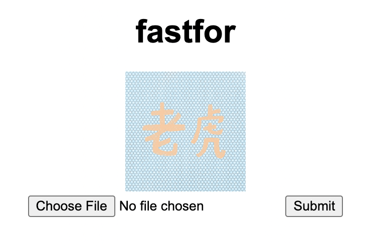

# cap

> Make the image different yet same!  
https://fastfor.chall.pwnoh.io

BuckeyeCTF 2022 (crypto, medium, 123 points)

Writeup by danlliu (WolvSec)

## Challenge Files

`check_hash.py: Python script text executable, ASCII text`

## Solution

Opening up the website shows the following UI:



Next, we can take a look at `check_hash.py`.

```python
from PIL import Image
import numpy

def check_hash(fi):
    image = numpy.asarray(Image.open('static/IMG.png'))
    submission = numpy.asarray(Image.open(fi))
    if image.shape != submission.shape:
        return False
    same = numpy.bitwise_xor(image, submission)
    if (numpy.sum(same) == 0):
        return False
    im_alt = numpy.fft.fftn(image)
    in_alt = numpy.fft.fftn(submission)
    im_hash = numpy.std(im_alt)
    in_hash = numpy.std(in_alt)
    if im_hash - in_hash < 1 and im_hash - in_hash > -1:
        return True
    return False
```

Here, we see that we have a custom "hash function" that takes the Fourier Transform of the image array, and uses the standard deviation of this resulting array as the hash value. Our goal is to create a hash collision, which occurs when the difference in standard deviations is less than 1.

The Fourier Transform converts a function into the frequency domain. Thus, small minor changes in the image may cause some small effects in the FT, but not enough to change the standard deviation signfiicantly. Thus, we can just change one pixel slightly, double checking the hash just to be sure.

```python
from PIL import Image
import numpy

def check_hash(i, j):
    image = numpy.asarray(i)
    submission = numpy.asarray(j)
    if image.shape != submission.shape:
        return False
    same = numpy.bitwise_xor(image, submission)
    if (numpy.sum(same) == 0):
        return False
    im_alt = numpy.fft.fftn(image)
    in_alt = numpy.fft.fftn(submission)
    im_hash = numpy.std(im_alt)
    in_hash = numpy.std(in_alt)
    if im_hash - in_hash < 1 and im_hash - in_hash > -1:
        return True
    return False

def generate_hash():
    i1 = numpy.array(Image.open('img.png'))
    i2 = numpy.array(Image.open('img.png'))
    i2[0][0][0] += 1

    print(i1)
    print(i2)

    if check_hash(i1, i2):
        print('success')
        outimg = Image.fromarray(i2)
        outimg.save('out.png')

generate_hash()
```

This generates the following output image:


Submitting this image to the website gives us the flag!

`Close enough, here's the flag!! buckeye{D33p_w0Rk_N07_WhY_574ND4RD_d3V}`
