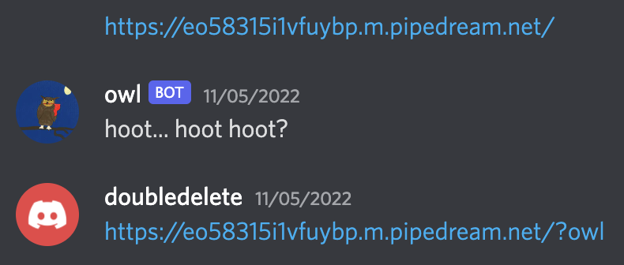

# owl

> This bird never goes ANYWHERE without its flag, but is your site hootin' enough? owl#9960

BuckeyeCTF 2022 (web, beginner, 70 points)

Writeup by danlliu (WolvSec)

## Challenge Files

`index.js: Unicode text, UTF-8 text, JavaScript source code`

## Solution

If we look at `index.js`, we see the following:

```javascript
const discord = require("discord.js");
const Browser = require("zombie");

const client = new discord.Client();
client.login(process.env.DISCORD_TOKEN);

const browser = new Browser();

function fly(url, content) {
	let bad = /<script[\s\S]*?>[\s\S]*?<\/script>/gi;

	return new Promise((resolve, reject) => {
		if(content.match(bad)) {
			resolve("hoot hoot!! >:V hoot hoot hoot hoot");
			return;
		}
	
		if(content.includes("cookie")) {
			resolve("hoooot hoot hoot hoot hoot hoot");
			return;
		}
	
		browser.visit(url, () => {
			let html = browser.html();
			if(html.toLowerCase().includes("owl")) {
				resolve("✨🦉 hoot hoot 🦉✨");
			} else {
				resolve("");
			}
		});
	})
}

function scout(url, host) {
	return new Promise((resolve, reject) => {
		if(!url.includes("owl")) {
			resolve("hoot... hoot hoot?");
			return;
		}

		browser.setCookie({
			name: "flag",
			domain: host,
			value: process.env.FLAG
		});

		browser.fetch(url).then(r => {
			return r.text();
		}).then(t => {
			return fly(url, t);
		}).then(m => {
			resolve(m);
		});
	});
}

client.on("ready", () => {
	console.log("Logged in as " + client.user.tag);
});

client.on("message", msg => {
	if(!(msg.channel instanceof discord.DMChannel))
		return;

	let url = /https?:\/\/(www\.)?([-a-zA-Z0-9@:%._\+~#=]{1,256}\.[a-zA-Z0-9()]{1,6}\b)([-a-zA-Z0-9()@:%_\+.~#?&//=]*)/i
	let match = msg.content.match(url);
	if(match) {
		scout(match[0], match[2]).then(res => {
			if(res.length > 0) {
				msg.channel.send(res);
			}
		});
	} else {
		if(msg.content.toLowerCase().includes("owl") || msg.mentions.has(client.user.id)) {
			msg.channel.send("✨🦉 hoot hoot 🦉✨");
		}
	}
});
```

We see that upon receiving a message, if the message has a URL, it calls `scout`. `scout` ensures that the URL includes `owl`, and then makes a request to that domain with a cookie set to the flag.

My first thought was to give the owl bot a `requestbin` link. `requestbin` is a website that allows you to create a quick HTTP server with an arbitrary URL that can receive requests. However, the `requestbin` URL did not contain `owl`.

To get around this problem, we use the fact that `owl` doesn't actually check that `owl` is stricly in the URL portion. Thus, we could add a query parameter, for example, `?owl`, to the end. Thus, we can utilize this to have `owl` send a request.



On `requestbin`'s side, we can see the flag!


Flag: `buckeye{7h3_m0r3_17_5335_7h3_1355_17_h0075}`

hoot... hoot hoot!
