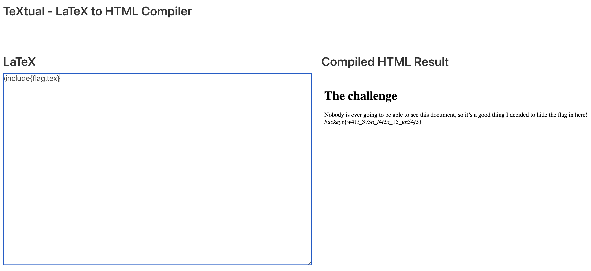

# textual

> I made a LaTeX to HTML converter. Why? Because I believe in more than WYSIWYG. Don't worry though, it's totally safe!  
https://textual.chall.pwnoh.io

BuckeyeCTF 2022 (web, beginner, 75 points)

Writeup by danlliu (WolvSec)

## Challenge Files

`textual.zip: Zip archive data, at least v1.0 to extract, compression method=store`

## Solution

We have a LaTeX to HTML converter! Let's take a look at the source code inside `textual.zip`:

```javascript
import express from 'express';
import rateLimit from 'express-rate-limit';
import { spawn, spawnSync } from 'child_process';
import * as fs from 'fs';
import path from 'path';
import os from 'os';
import morgan from 'morgan';

const app = express();
app.use(morgan('combined'))
app.use(express.static('static'));
app.use(express.json());

const port = 8000;

app.use(
  '/compile',
  rateLimit({
    windowMs: 60 * 1000,
    max: 3,
    message: { error: 'Too many requests, try again later' }
  })
)

async function createHTML(code) {
  // create temp folder to write all files to
  const folder = fs.mkdtempSync(path.join(os.tmpdir(), 'output-'))

  fs.writeFileSync(path.join(folder, "temp.tex"), code);

  const child = spawnSync("pandoc", [path.join(folder, "temp.tex"), "-o" , path.join(folder, "temp.html"), "+RTS", "-M512M", "-RTS", "--verbose"]);
    
  if (child.error != undefined) {
    return undefined
  }

  return fs.readFileSync(path.join(folder, "temp.html"), {encoding:'utf8', flag:'r'})
}

app.post("/compile", async (req, res) => {
  if (req.query.code === undefined || req.query.code=== "") {
    return res.sendStatus(400);
  }

  let html = await createHTML(req.query.code)

  if (html === undefined) {
    return res.sendStatus(500)
  }

  res.status(200)
  res.setHeader('content-type', 'text/html');
  res.send(html)
})

app.listen(port, async () => {
  console.log(`[*] Listening on port ${port}`);
})
```

Additionally, in the file system, we see that a file called `flag.tex` exists. In this case, we see that `pandoc` runs in the root directory, where `flag.tex` is located. Thus, we can utilize LaTeX's `\include` command:

```latex
\include{flag.tex}
```



Flag: `buckeye{w41t_3v3n_l4t3x_15_un54f3}`
